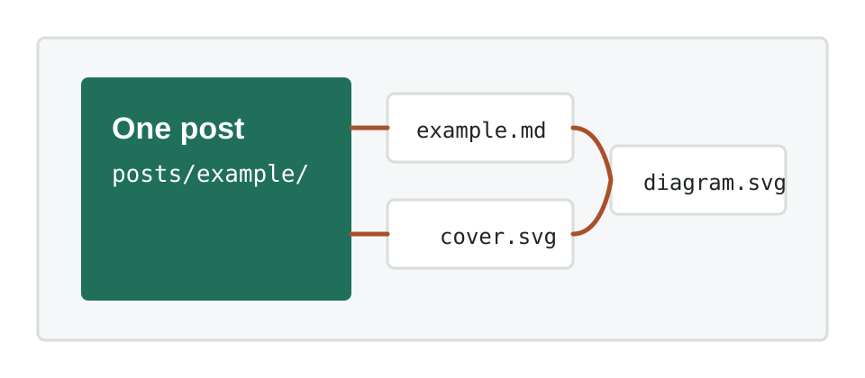

This is an example post you can copy when creating a new article.

This file is named `example.md`, and every image used by this post is stored in the same folder:

```text
posts/example/
├── example.md
├── cover.svg
└── diagram.svg
```

Because this post uses `example.md` instead of `index.md`, it includes this front matter line:

```yaml
permalink: /posts/example/
```

That keeps the final page URL aligned with the folder, so relative image links work correctly.

## Add An Image

Put the image file next to this Markdown file, then reference it with a relative path:

```markdown

```

Rendered result:


## Create Your Own Post

Copy the `posts/example/` folder, rename it, and update these fields:

- `title`
- `date`
- `description`
- `tags`
- `permalink`
- `cover`
- `cover_alt`

For example, if your new folder is `posts/my-first-build/`, set:

```yaml
permalink: /posts/my-first-build/
cover: "cover.jpg"
```
