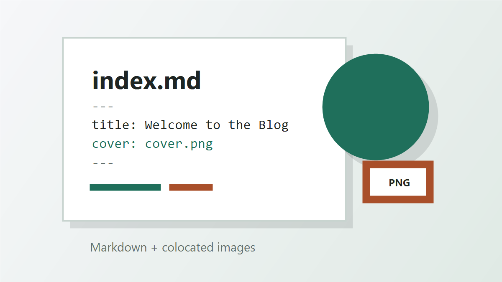

This sample post lives in `posts/welcome/`. The Markdown file, cover image, and any other images for this article stay together in the same folder.



## Why This Structure

Keeping everything for a post in one folder makes the blog easier to maintain:

- Move or delete a post without hunting through a shared image directory.
- Keep image references short and readable.
- Draft posts locally with the same relative paths that GitHub Pages will use.

## Adding More Images

Add image files next to `index.md`:

```text
posts/welcome/
├── index.md
├── cover.png
└── architecture-diagram.png
```

Then reference them in Markdown:

```markdown

```

## Create Your Next Post

Copy this folder, rename it, update the front matter, and replace the Markdown content with your article.
